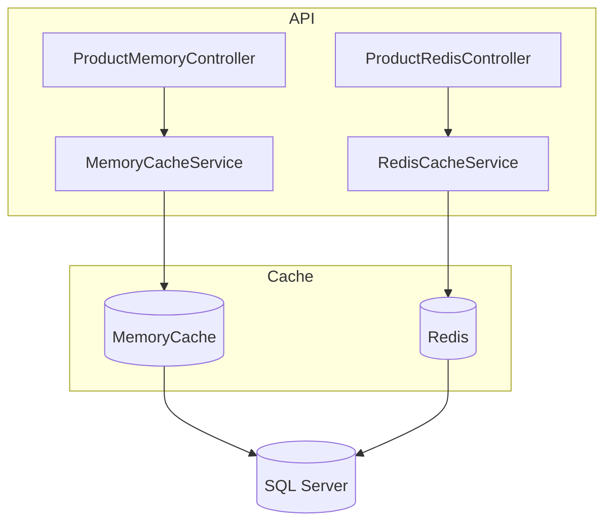

# CacheDotNetAPI &nbsp;     

> **Educational showcase** comparing **Memory Cache** vs **Distributed Cache (Redis)** in a .NET 9 Web API.

---

## ✨ Key Features

| Area | Details |
|------|---------|
| **Dual Caching Strategies** | Toggle between `IMemoryCache` and `IDistributedCache` (Redis) via dedicated controllers |
| **EF Core + SQL Server** | Products fetched from DB, then cached for repeat hits |
| **Cache Invalidation** | Clear single‑key or full cache through API |
| **Observable Metrics** | Serilog console output + `/healthz` endpoint |
| **Docker First** | One‑command `docker compose` for SQL Server + Redis |
| **Swagger Docs** | Try requests directly in the browser |

---

## 🗂️ Project Structure



> - `MemoryCacheService` caches **in‑process** (fastest, but per‑instance)  
> - `RedisCacheService` caches in **Redis** (shared across pods / servers)

---

## 📚 REST Endpoints

| Controller | Verb | Path | Description |
|------------|------|------|-------------|
| Memory | `GET` | `/api/productMemory/getproduct/{id}` | Get product (memory cache) |
| Memory | `DELETE` | `/api/productMemory/clearcache/{id}` | Remove product from memory cache |
| Distributed | `GET` | `/api/productRedisCache/getproduct/{id}` | Get product (Redis cache) |
| Distributed | `DELETE` | `/api/productRedisCache/clearcache/{id}` | Remove product from Redis cache |
| Global | `GET` | `/healthz` | Readiness / liveness probe |

### 🔑 Sample: get product via Redis cache

```jsonc
// GET /api/productRedisCache/getproduct/1
// 1st call – miss → fetch DB → cache
{
  "productId": 1,
  "name": "Demo Mouse",
  "price": 29.9,
  "fromCache": false
}

// Subsequent calls – served from Redis
{
  "productId": 1,
  "name": "Demo Mouse",
  "price": 29.9,
  "fromCache": true,
  "cachedAt": "2025-04-22T15:35:00Z"
}
```

### 🔑 Sample: clear memory‑cache key

```bash
DELETE /api/productMemory/clearcache/1
```

Response:

```json
{
  "status": 200,
  "message": "Cache entry removed"
}
```

---

## 🚀 Quick Start

```bash
git clone https://github.com/tanapoomjaisabay/CacheDotNetAPI.git
cd CacheDotNetAPI
docker compose up -d        # spin up redis + sqlserver
dotnet run --project CacheDotNetAPI
```

Swagger UI → <https://localhost:5000/swagger>

---

## 🛠️ Tech Stack

- **ASP.NET Core 9** Web API  
- **EF Core** code‑first  
- **SQL Server 2022** (Docker)  
- **Redis 7** (Docker)  
- **Serilog** logging  
- **Docker Compose**  
- **GitHub Actions** (CI)

---

## 🤝 Contributing

PRs are welcome! Feel free to open issues, suggest refactors, or add new features.

---

## 📜 License

Distributed under the **MIT** license. See `LICENSE` for more info.
