# CacheDotNetAPI       

> **Educational showcase** comparing **Memory Cache** vs **Distributed Cache (Redis)** in a .NET 9 Web API.

---

## ✨ Key Features

| Area | Details |
|------|---------|
| **Dual Caching Strategies** | Toggle between `IMemoryCache` and `IDistributedCache` (Redis) via dedicated controllers |
| **EF Core + SQL Server** | Products fetched from DB, then cached for repeat hits |
| **Cache Invalidation** | Clear single‑key or full cache through API |
| **Observable Metrics** | Serilog console output + `/healthz` endpoint |
| **Docker First** | One‑command `docker compose` for SQL Server + Redis |
| **Swagger Docs** | Try requests directly in the browser |

---

## 🗂️ Project Structure

```mermaid
flowchart TD
    subgraph API
        C1[ProductMemoryController] --> S1[MemoryCacheService]
        C2[ProductRedisController]  --> S2[RedisCacheService]
    end
    subgraph Cache
        S1 --> MC[(MemoryCache)]
        S2 --> RC[(Redis)]
    end
    MC & RC --> DB[(SQL Server)]
```



> - `MemoryCacheService` caches **in‑process** (fastest, but per‑instance)  
> - `RedisCacheService` caches in **Redis** (shared across pods / servers)

---

## 📚 REST Endpoints

| Controller | Verb | Path | Description |
|------------|------|------|-------------|
| Memory | `GET` | `/api/productMemory/getproduct/{id}` | Get product (memory cache) |
| Memory | `DELETE` | `/api/productMemory/clearcache/{id}` | Remove product from memory cache |
| Distributed | `GET` | `/api/productRedisCache/getproduct/{id}` | Get product (Redis cache) |
| Distributed | `DELETE` | `/api/productRedisCache/clearcache/{id}` | Remove product from Redis cache |
| Global | `GET` | `/healthz` | Readiness / liveness probe |

### 🔑 Sample: get product via Redis cache

```bash
GET /api/productRedisCache/getproduct/10001
```

Response:

```jsonc
{
  "data": [
    {
      "idKey": 1,
      "productCode": "10001",
      "productName": "Laptop",
      "productDesc": "Gaming Laptop",
      "price": 45000
    }
  ],
  "status": 200,
  "success": true,
  "message": "",
  "error": null
}
```

### 🔑 Sample: clear memory‑cache key

```bash
GET /api/productMemory/clearcache/10001
```

Response:

```json
{
  "data": [],
  "status": 200,
  "success": true,
  "message": "",
  "error": null
}
```

---

## 🚀 Quick Start

```bash
git clone https://github.com/tanapoomjaisabay/CacheDotNetAPI.git
cd CacheDotNetAPI
docker compose up -d        # spin up redis + sqlserver
dotnet run --project CacheDotNetAPI
```

Swagger UI → <https://localhost:5000/swagger>

---

## 🛠️ Tech Stack

- **ASP.NET Core 9** Web API  
- **EF Core** code‑first  
- **SQL Server 2022** (Docker)  
- **Redis 7** (Docker)  
- **Serilog** logging  
- **Docker Compose** 

---

## 🤝 Contributing

PRs are welcome! Feel free to open issues, suggest refactors, or add new features.

---

## 📜 License

Distributed under the **MIT** license. See `LICENSE` for more info.
